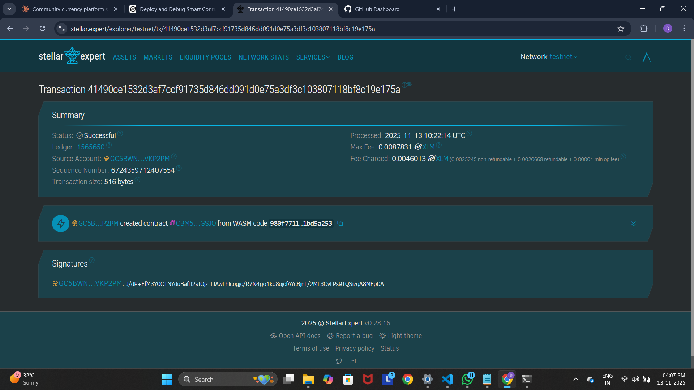

# Community Currency Platform

## Project Title
**Community Currency Platform on Stellar**

## Project Description
The Community Currency Platform is a blockchain-based solution built on the Stellar network using Soroban smart contracts. It enables local communities to issue, manage, and trade their own custom tokens, fostering economic activity and trade within defined communities. This platform empowers communities to create their own localized economy, allowing members to exchange goods and services using community-specific currency tokens.

The smart contract provides essential functionality for initializing a community currency, transferring tokens between members, and tracking balances - creating a foundation for community-driven economic systems.

## Project Vision
Our vision is to democratize currency creation and enable local communities to build resilient, self-sustaining economies. By leveraging blockchain technology on Stellar, we aim to:

- **Empower Communities**: Give communities control over their economic tools and enable them to create value systems that reflect their unique needs and values
- **Foster Local Trade**: Encourage local commerce and strengthen community bonds through a shared medium of exchange
- **Financial Inclusion**: Provide access to digital currency systems for underserved communities and regions with limited banking infrastructure
- **Economic Resilience**: Enable communities to create complementary currencies that can buffer against external economic shocks
- **Transparent Governance**: Utilize blockchain's transparency to ensure fair and auditable currency management

## Key Features

### 1. **Currency Initialization**
- Community administrators can create a new currency with custom name and symbol
- Define initial token supply based on community needs
- One-time initialization ensures currency integrity
- Admin authentication required for security

### 2. **Secure Token Transfers**
- Peer-to-peer token transfers between community members
- Built-in authentication to prevent unauthorized transactions
- Balance validation to ensure sufficient funds
- Real-time balance updates for both sender and receiver

### 3. **Balance Tracking**
- Query any member's token balance
- Transparent balance verification for all participants
- Automatic balance initialization for new users

### 4. **Currency Information Access**
- Retrieve complete currency details including name, symbol, and total supply
- View community administrator address
- Public access to currency metadata for transparency

### 5. **Built on Stellar/Soroban**
- Leverages Stellar's fast and low-cost blockchain infrastructure
- Utilizes Soroban's secure smart contract environment
- Extended TTL (Time To Live) for persistent storage
- Optimized for performance and scalability

## Future Scope

### Short-term Enhancements
- **Minting & Burning**: Allow controlled increase or decrease of token supply by admin
- **Transaction History**: Track and display complete transaction logs for auditing
- **Multi-signature Support**: Require multiple admin approvals for critical operations
- **Transfer Limits**: Implement daily/weekly transfer limits for security

### Medium-term Development
- **Staking Mechanisms**: Enable users to stake tokens and earn rewards for community participation
- **Governance Module**: Implement voting systems for community decisions using token-weighted voting
- **Exchange Integration**: Create swap functionality to exchange community tokens with other currencies
- **Mobile Application**: Develop user-friendly mobile apps for iOS and Android

### Long-term Vision
- **Cross-Community Trading**: Enable interoperability between different community currencies
- **Smart Escrow**: Implement escrow services for secure trading of goods and services
- **Loan Systems**: Create peer-to-peer lending mechanisms within the community
- **Merchant Integration**: Develop point-of-sale solutions for local businesses
- **Analytics Dashboard**: Provide economic insights and token circulation metrics
- **DeFi Integration**: Connect with decentralized finance protocols for advanced financial services
- **Identity Verification**: Integrate decentralized identity solutions for KYC compliance
- **Automated Market Makers**: Implement AMM pools for liquidity provision

### Scalability & Ecosystem
- **Multi-chain Support**: Expand beyond Stellar to other blockchain networks
- **API Development**: Create comprehensive APIs for third-party integrations
- **Community Toolkit**: Provide templates and tools for easy currency launch
- **Educational Resources**: Develop documentation and training materials for communities
- **Global Network**: Build a federation of community currencies supporting each other

---

## Technical Specifications

**Blockchain**: Stellar  
**Smart Contract Platform**: Soroban SDK  
**Language**: Rust  
**Storage**: Instance storage with extended TTL  
**Authentication**: Address-based with require_auth()

## Getting Started

### Prerequisites
- Rust toolchain
- Soroban CLI
- Stellar account for deployment

### Installation
```bash
# Clone the repository
git clone <repository-url>

# Build the contract
soroban contract build

# Deploy to Stellar network
soroban contract deploy --wasm target/wasm32-unknown-unknown/release/[contract_name].wasm
```

## License
This project is open-source and available for community use and enhancement.

---

**Building the future of community-driven economies, one token at a time.**

